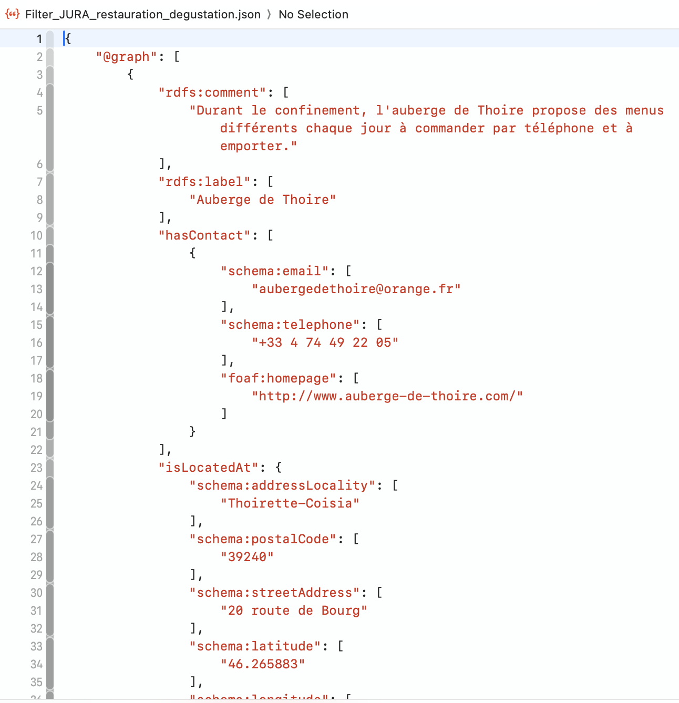
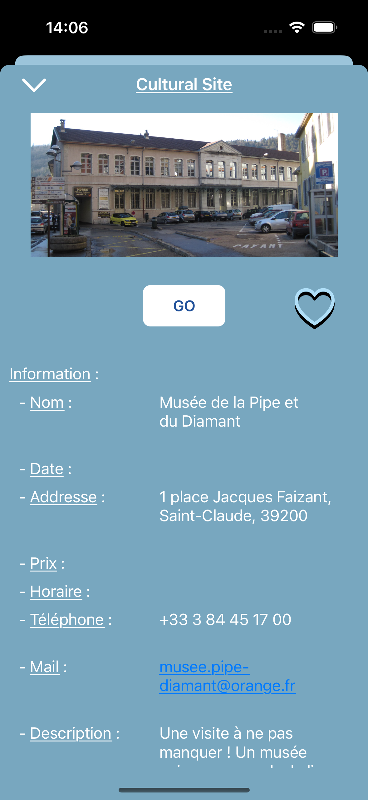

# MonBonCoin 🗺️🍽️🎭  
A Smart Local Discovery App  
  
MonBonCoin is an iOS application designed to help users explore cultural, gastronomic, and recreational points of interest across France.  
The app provides a sleek interface with data fetched from a custom-built Firebase backend, powered by refined open-data from DATAtourisme. 

## 📱 Features

- Tab-based navigation: **Search**, **Favorites**, **History**
- Department-based content filtering
- Multiple categories: restaurants, cultural sites, events, routes, and more
- Offline-first approach using **CoreData** with batch insert
- Favorites system with category/department filters
- Navigation history tracking
- Shuffle button for random discovery
- Detailed modal view with full item info
- Firebase integration for crash & usage analytics
- Fully tested model layer with 100% coverage

## 🔍 App Structure

### 🧭 Tab Bar
1. **Search** – Choose a department and categories, load and display data from Firebase.
2. **Favorites** – View and manage saved items, filtered by department or category using a segmented control.
3. **History** – Access previously visited detail pages.

### 🌐 Data Source
The raw data used in this project comes from the official French open-data platform **[DATAtourisme](https://info.datatourisme.fr/)**.

### 📦 Data Flow
- Open-data from **DATAtourisme** is pre-processed with a Python script to eliminate unnecessary fields.
- Cleaned data is uploaded to **Firebase Realtime Database** and served as a REST API.
- The app fetches data on first load or on user demand and stores it in **CoreData** using batch inserts to minimize network usage.

## ⚠️ Data Availability per Department

To demonstrate the app’s functionality, only a **subset of French departments** is currently available in both the Firebase database and the app interface.

The data model and architecture are designed to support **all departments**, but due to time and resource constraints — especially given the complexity of generating and cleaning DATAtourisme data — only a sample has been processed so far.

> This limitation does not cause any crashes.  
> Only departments included in the app’s list are selectable — others are not shown.  
> This prevents user frustration and avoids repeated display of the alert:
> _"Ce département n’est pas encore disponible. Les données sont en cours d’intégration."_

This approach keeps the app stable and functional while still showcasing its key features.  
New departments can easily be added later by running the data cleaning script on additional regions and uploading the output to Firebase.

### 📊 Categories
Users can explore:
- Restaurants
- Cultural & historical sites
- Sports & recreational venues
- Cultural/social/commercial events
- Cycling and hiking routes

### 🔀 Special Feature
- **Shuffle Button**: Randomly selects a point of interest from the current filtered list.

## 🧼 Data Preprocessing

The raw dataset from **DATAtourisme** is very rich and detailed — but also large and nested, making it unsuitable for direct mobile usage.

To adapt the data for the MonBonCoin app, a custom Python script was written to:

- Extract only the useful fields (e.g. name, contact, address, dates, prices, media)
- Flatten nested objects
- Normalize all fields into consistent lists for easier decoding
- Minimize the payload size for faster import into CoreData

📁 Related Python script: [`scripts/clean_datatourisme.py`](scripts/clean_datatourisme.py)

Example before vs after cleaning:

| Raw JSON (original) | Cleaned JSON (ready for mobile) |
|---------------------|---------------------------------|
|  |  |

> Note: This script is intentionally simple, focused on effectiveness and structure reduction.
  
## 🧾 Detail View

When tapping on a result, a modal popup is presented with:
- Category tag
- Image (if available)
- External website link (if provided)
- Favorite toggle (❤️)
- Detailed info in a structured `UITableView`:
  - Name
  - Date (event or availability)
  - Address
  - Price
  - Opening hours
  - Phone number
  - Email (underlined and highlighted)
  - Description

## 🔧 Technologies

- **Swift + UIKit**
- **CoreData**
- **Firebase Realtime Database** (REST API usage)
- **Firebase Analytics & Crashlytics**
- **Python** (for pre-processing raw open-data)

## 📈 Analytics Events

| Event Name        | Purpose                                                                 |
|-------------------|-------------------------------------------------------------------------|
| `session_start`   | Default Firebase session tracking                                        |
| `user_engagement` | Tracks app interaction                                                   |
| `first_open`      | Detects first app launch                                                 |
| `press_shuffle`   | Indicates use of the Shuffle feature                                     |
| `department`      | Tracks which departments are searched the most                          |
| `category`        | Tracks which data types are viewed frequently                           |
| `isFavorite`      | Tracks which items are saved to favorites                               |
| `isNotFavorite`   | Tracks when users remove items from favorites                           |

These metrics guide future updates, content prioritization, and potential enhancements.

## ✅ Testing

- Unit testing with `XCTest`
- **100% model layer test coverage**

## 🚀 First Launch Flow

- On first app launch, users are prompted to choose a department to fetch initial data.
- From there, they can easily change departments or categories, browse, and interact.

## 🧠 Future Considerations

- Spotlight feature for most favorited places
- Personalized recommendations based on usage analytics
- Smart cache invalidation/update system for high-demand departments

## 🔒 Firebase Access & Analytics Configuration

The **"Firebase Realtime Database"** used in this project is set to read-only mode and is accessible via REST API for data retrieval only.
You will not be able to write to the database or access usage data from Analytics or Crashlytics in this shared setup.

If you wish to track your own analytics events or monitor crashes, you’ll need to:

1. Create your own Firebase project at console.firebase.google.com.

2. Enable Analytics and Crashlytics in the Firebase dashboard.

3. Download your GoogleService-Info.plist file.

4. Replace the existing one in the Xcode project.

> Note: This will allow you to collect your own usage metrics and error logs independently from the original project.

## 🗂️ Project Setup

### 1. Clone the Repository
```bash
git clone https://github.com/yourUsername/MonBonCoin.git
```
### 2. GoogleService-Info.plist
- Ensure you have a Firebase account and set up your GoogleService-Info.plist  
- Replace the current `GoogleService-Info.plist` with the one you generated
  
## 📸 Screenshots
<table>
  <tr>
    <th colspan="3">First Launch</th>
  </tr>
  <tr>
    <td></td>
    <td></td>
    <td></td>
  </tr>
</table>

<table>
  <tr>
    <th colspan="5">Search</th>
  </tr>
  <tr>
    <td></td>
    <td></td>
    <td></td>
    <td></td>
    <td></td>
  </tr>
</table>

<table>
  <tr>
    <th colspan="3">Favorite - History</th>
  </tr>
  <tr>
    <td></td>
    <td></td>
    <td></td>
  </tr>
</table>

## 📚 Notes
MonBonCoin was initially created as part of a training program, but quickly became a personal challenge to push my skills further.  
It gave me the opportunity to go beyond UI building by handling real-world data issues: API design, JSON cleaning, Firebase integration, and offline storage with CoreData.

This project reflects my ability to bring together multiple layers of an app — from raw data preprocessing in Python to user-facing mobile features — with a strong focus on performance and UX.

## 👤 About Me
I'm Nicolas Schena, an iOS developer passionate about building useful, elegant, and scalable mobile applications.  
MonBonCoin is one of my most complete training projects — it combines:  
- REST API consumption via Firebase
- Offline data storage using CoreData
- UI/UX using UIKit
- Real-world data preprocessing using Python
  
Beyond just building interfaces, I enjoy solving data flow and performance challenges, especially when bridging external data sources with a smooth iOS experience.  
I'm now focusing on mastering modern tools like SwiftUI, Combine, and modular architecture patterns to bring even more structure and performance to future apps. 
## 🔗 Connect
- [LinkedIn](https://www.linkedin.com/in/nicolas-schena-413056155/)
- [Other Projects](https://github.com/SchenaNicolas-Pro)
